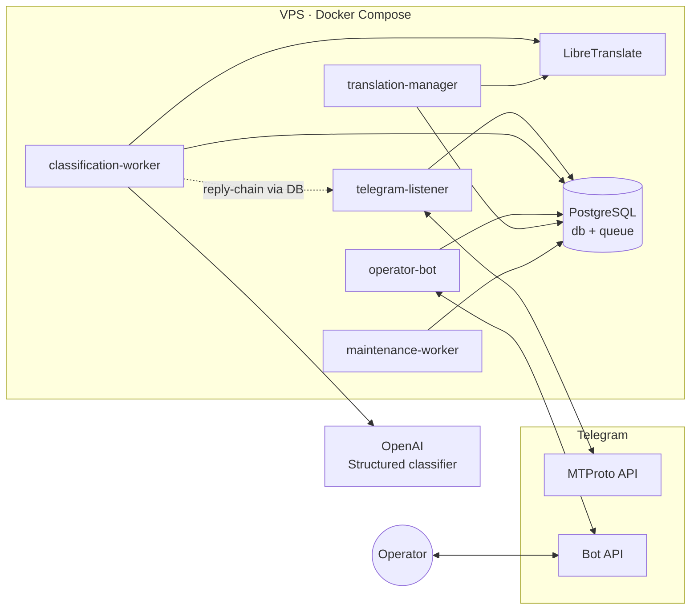

# Telegram Community Lead Assistant

> Operator-assisted lead discovery for professional Telegram communities — find genuine
> questions worth answering, never spam.

[](https://www.python.org/)
[](http://mypy-lang.org/)
[](https://github.com/astral-sh/ruff)
[](#testing)
[](LICENSE)

A self-hosted system that monitors selected Telegram groups through a working account,
uses an LLM to detect substantive professional questions (technical, operational,
analytics, strategy, e-commerce), and surfaces them to a single operator through a
private bot. The operator reviews the original reply-chain with a local Russian
translation, writes an answer by hand, previews it, and — only after explicit
confirmation — the reply is posted from the working account.

**Nothing is ever sent automatically.** No auto-generated answers, no mass messaging, no
channel scraping. The human is always in the loop.

---

## Why it exists

Advertising directly in professional communities reads as spam and destroys trust. The
effective path is to participate first: answer real questions well, build recognition, and
only then — where the community allows — make a careful offer. Doing that manually across
several busy chats is expensive. This assistant does the watching and triage so a human
can focus on writing good answers.

## Features

- **MTProto monitoring** of groups, supergroups, and forum supergroups (channels are never monitored).
- **Two-stage LLM classification** — stage 1 on the message alone; stage 2 with reply
  context only when required. Strict OpenAI Structured Outputs, max two calls per message.
- **Conservative local prefilter** drops obvious noise before any paid API call.
- **Reliable PostgreSQL queue** — `FOR UPDATE SKIP LOCKED`, at-least-once delivery,
  idempotent handlers, bounded retry, stale-lock recovery. Handles 10k+ messages/day.
- **Reply-chain context** up to 10 messages, with **local translation to Russian** via
  self-hosted LibreTranslate (no per-character billing; `en`/`ru` always on, more on demand).
- **Operator bot** (aiogram) — leads with chat/topic/author/category/confidence, original +
  translation, open-original links, and a manual draft → preview → confirm → send/edit flow.
- **Controlled outbound** — replies posted by the working account only after confirmation;
  idempotent send, forum-topic aware, no auto-retry on ambiguous results.
- **Operations built in** — health/status, structured content-free metrics, budget alerts
  ($5/$8/$10), daily chat-access verification, TTL retention (24h temp / 60d relevant /
  30d logs), and an encrypted backup/restore runbook.
- **Privacy by design** — irrelevant text deleted immediately; message bodies, drafts,
  prompts, and secrets never logged; single-operator authorization on every handler.
- **Safe staged rollout** — feature flags gate monitoring, notifications, and outbound with
  outbound disabled by default.

## Architecture

Six single-purpose processes share one code base and a PostgreSQL database that doubles as
the job queue. Only `telegram-listener` holds the MTProto session; only
`classification-worker` calls OpenAI and the translator.



**Pipeline:** listener ingests → prefilter → queue → stage-1 classify → (reply-chain +
stage-2 if needed) → translate → operator notification → manual draft → confirm → send.

## Tech stack

Python 3.12 · asyncio · Telethon (MTProto) · aiogram 3 (bot) · OpenAI Responses API ·
SQLAlchemy 2 async + Alembic · PostgreSQL 17 · LibreTranslate · Docker Compose ·
ruff · mypy (strict) · pytest.

## Quick start (local development)

Requires Python 3.12+ and [`uv`](https://github.com/astral-sh/uv).

```bash
uv sync --all-groups

# Fast checks (network-free)
make format-check lint typecheck unit evaluate

# Full gate: PostgreSQL integration tests, Compose validation, image build
make integration
make check
```

`make evaluate` runs a versioned 100-message classification dataset against a deterministic
fake (no network) and prints precision/recall. A live evaluation is opt-in and reads the
API key from the environment without printing or storing it:

```bash
OPENAI_API_KEY=... uv run python -m app.classifier.evaluation --live
```

Service entry points start and shut down cleanly without network access:

```bash
uv run python -m app.listener
uv run python -m app.classifier.worker
uv run python -m app.bot
uv run python -m app.translation.manager
uv run python -m app.maintenance
```

## Running with Docker Compose

```bash
cp .env.example .env    # fill in real values, see Configuration
docker compose up -d --build --wait
docker compose run --rm maintenance-worker alembic upgrade head
docker compose run --rm telegram-listener python -m scripts.create_mtproto_session
```

PostgreSQL (5432) and LibreTranslate (5000) are only reachable on the internal `backend`
network — neither is published on the host.

- **Server deployment checklist:** [`docs/DEPLOYMENT.md`](docs/DEPLOYMENT.md)
- **Staged go-live (shadow → notification → controlled reply):** [`docs/GO_LIVE_RUNBOOK.md`](docs/GO_LIVE_RUNBOOK.md)
- **Backup & restore:** [`docs/BACKUP_RESTORE.md`](docs/BACKUP_RESTORE.md)

## Configuration

All configuration is environment-based and validated at startup (`app/config.py`); missing
required values fail before any network access. See [`.env.example`](.env.example) for the
full list. Key groups:

| Group | Variables |
|---|---|
| Feature flags | `MONITORING_ENABLED`, `NOTIFICATIONS_ENABLED`, `OUTBOUND_REPLIES_ENABLED`, `TRANSLATION_ENABLED` |
| Telegram | `TELEGRAM_API_ID`, `TELEGRAM_API_HASH`, `TELEGRAM_SESSION_PATH`, `OPERATOR_BOT_TOKEN`, `OPERATOR_TELEGRAM_USER_ID` |
| OpenAI | `OPENAI_API_KEY`, `OPENAI_CLASSIFIER_MODEL`, `OPENAI_CLASSIFIER_*_PRICE_PER_MILLION_USD` |
| Retention | `MESSAGE_RETENTION_DAYS` (60), `TEMPORARY_MESSAGE_TTL_HOURS` (24), `TECHNICAL_LOG_RETENTION_DAYS` (30) |
| Budget alerts | `API_INFO/WARNING/CRITICAL_THRESHOLD_USD` (5/8/10) |

`OUTBOUND_REPLIES_ENABLED` defaults to `false`: the system can watch and notify without any
risk of sending until you explicitly enable it. Flags are read at container start.

## Testing

| Suite | What it covers |
|---|---|
| `make unit` | 203 tests — domain logic, config, workers, bot flows, redaction (network-free) |
| `make integration` | 27 tests on an isolated PostgreSQL — queue semantics, migrations, persistence, load |
| `make evaluate` | 100-fixture classifier evaluation, deterministic fake (precision/recall/accuracy = 1.000) |

Automated tests never call real Telegram, OpenAI, or LibreTranslate. Live Telegram
acceptance is documented and opt-in only ([`docs/STAGING_TELEGRAM_ACCEPTANCE.md`](docs/STAGING_TELEGRAM_ACCEPTANCE.md)).

## Project structure

```
app/
  listener/      MTProto ingestion, reply-chain, outbound send/edit (session owner)
  classifier/    OpenAI adapter, stage-1/stage-2, usage accounting, evaluation
  translation/   LibreTranslate client, language management, controlled reload
  bot/           aiogram operator bot: chats, leads, drafts, status, alerts
  maintenance/   scheduler, retention cleanup, stale-lock recovery, chat verification
  database/      SQLAlchemy models, queue repository, health
  domain/        enums, services, errors
  rollout/       shadow-mode reporting
alembic/         migrations
docs/            SPEC, backlog, decisions (ADRs), runbooks
scripts/         session creation, health check, shadow report
```

## Security & privacy

- Single-operator authorization enforced on every bot update and callback.
- Never logged: message content, translations, drafts/replies, prompts, bot token,
  OpenAI key, phone number, `api_hash`, MTProto session.
- PostgreSQL and LibreTranslate ports are never published to the host.
- The operator bot has no Docker socket access; the translation manager reloads models
  through a locked-down PID-namespace control plane (see ADR-005).
- Only relevant leads are retained (60 days); irrelevant text is deleted immediately.

## Project status

MVP is code-complete and certified (M1–M9 done, M10 controlled rollout in progress). The
remaining work is operational staged rollout on live community chats — see
[`docs/GO_LIVE_RUNBOOK.md`](docs/GO_LIVE_RUNBOOK.md) and [`docs/BACKLOG.md`](docs/BACKLOG.md).

Engineering conventions and the task-driven build workflow are described in
[`AGENTS.md`](AGENTS.md) and [`PROMPTING_SYSTEM.md`](PROMPTING_SYSTEM.md).

## License

Released under the [MIT License](LICENSE).
</content>
